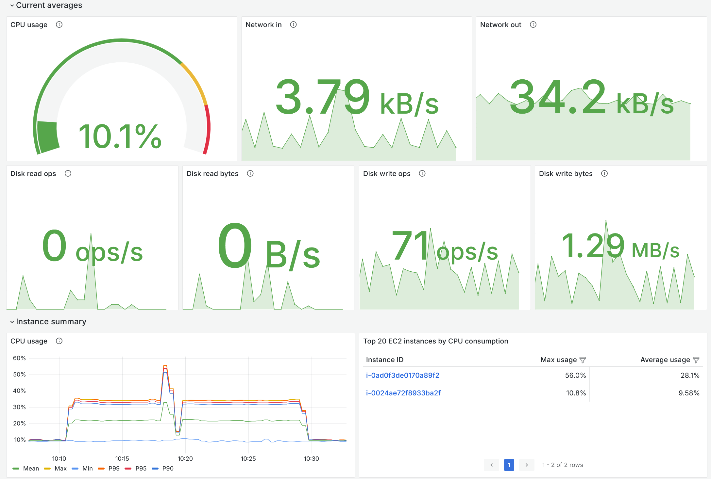

# Amazon GameLift Servers Plugin for Unity

# Overview

[Amazon GameLift Servers](https://aws.amazon.com/gamelift/servers/) is a fully managed service that gives game developers the ability to manage and scale dedicated game servers for session-based multiplayer games.
The **Amazon GameLift Servers Plugin for Unity** streamlines the process of setting up a game project in Unity for hosting on Amazon GameLift Servers.
With the plugin added to your Unity game project, you can work with Amazon GameLift Servers from inside the Unity Editor. Use the plugin to complete these steps:

* Integrate your game server code with the server SDK for Amazon GameLift Servers (included with the plugin), so that the game server can communicate with the service and respond to prompts to start and run game sessions.
* Deploy your integrated game server to an Amazon GameLift Servers fleet. Use the plugin’s guided workflows to configure and deploy a Windows or Linux game server using any of these deployment options. [Learn more about each option.](https://docs.aws.amazon.com/gamelift/latest/developerguide/gamelift-intro-flavors.html#gamelift-intro-flavors-hosting)
   * **Anywhere fleet.** Deploy an Anywhere fleet to run game servers on hosting resources that you control. Anywhere fleets are commonly used to test on a local device, or to act as test environments for iterative development. You can also use Anywhere fleets to set up game hosting on-premises hardware, other resources, or as part of a hybrid solution.
   * **Managed EC2 fleet.** Deploy a managed EC2 fleet to run game servers on AWS Cloud resources that are managed by Amazon GameLift Servers. With this option you get resources and management tools (such as automatic scaling) that are optimized for multiplayer game hosting.
   * **Managed container fleet (for Linux servers).** Deploy a managed container fleet to run game servers on AWS Cloud resources in a containerized environment. Container fleets are managed by Amazon GameLift Servers and provide EC2 resources and management tools (such as automatic scaling) that are optimized for multiplayer game hosting.
* Build a backend service with the AWS SDK for Amazon GameLift Servers (included with the plugin) and add functionality to your game client to start a game session and connect to it. When you deploy to a managed fleet, the plugin also deploys a simple backend service for your game. You can use the default backend service or customize it as needed.
* Perform tests using plugin functionality to start a game client and join a running game session.
* Continue to use the plugin’s SDKs and tools when you want to customize your game hosting beyond the plugin’s guided workflows.

When deploying a game server to a fleet for hosting, Amazon GameLift Servers uses an AWS CloudFormation template to create a resource stack for your solution. You can view and manage your resource stacks in the AWS Management Console for AWS CloudFormation.


- [Prerequisites](#prerequisites)
- [Install the plugin](#install-the-plugin)
- [Contributing to this plugin](#contributing-to-this-plugin)
- [FAQ](#faq)
- [Amazon GameLift Servers Resources](#amazon-gamelift-servers-resources)

## Prerequisites

* Amazon GameLift Servers plugin for Unity download package. Download a zip file from [the GitHub Releases page](https://github.com/amazon-gamelift/amazon-gamelift-plugin-unity/releases). Or clone the plugin from the [GitHub repo](https://github.com/amazon-gamelift/amazon-gamelift-plugin-unity).
* A compatible Unity editor (2021.3 LTS, 2022.3 LTS) with Dedicated Server Build Support module for Windows (and Linux if desired).
* (Optional) A C# multiplayer game project with game code.
* An AWS account with access permissions to use Amazon GameLift Servers, Amazon S3, and AWS CloudFormation. See [Set up programmatic access](https://docs.aws.amazon.com/gamelift/latest/developerguide/setting-up-aws-login.html) with long-term credentials.

## Install the plugin

Complete the following steps to install and enable the plugin for your multiplayer game project.

1. Add UnityNuGet to your game project
   1. In your Unity project, open `Edit > Project Settings > Package Manager`.
   2. Under `Scoped Registries`, click on the `+` button and enter the values for the [UnityNuGet](https://github.com/xoofx/UnityNuGet) scoped registry:
        ```
        Name: Unity NuGet
        Url: https://unitynuget-registry.openupm.com
        Scope(s): org.nuget
        ```
   > **[Note]** After setting up dependencies, if you see the **Assembly Version Validation** errors in the console:
   > 1. In the Unity editor, go to the main menu and select Edit, Project Settings, and open the Player section.
   > 2. Deselect the Assembly Version Validation option.

2. Add the Amazon GameLift Servers SDK for Unity package.
   1. Find the `com.amazonaws.gameliftserver.sdk-<version>.tgz` tarball file within the downloaded release zip or follow the [contribution guide](#contributing-to-this-plugin) to build the tarball yourself.
   2. In your Unity project, open `Window > Package Manager`.
   3. Click `+ > Add package from tarball...` and select the above tarball.

3. Add the Amazon GameLift Servers Plugin for Unity package.
    1. Find the `com.amazonaws.gamelift-<version>.tgz` tarball file within the downloaded release zip or follow the [contribution guide](#contributing-to-this-plugin) to build the tarball yourself.
    2. In your Unity project, open `Window > Package Manager`.
    3. Click `+ > Add package from tarball...` and select the above tarball.
    > **[Note]** If you see an error like `Packages/com.amazonaws.gamelift/Editor/Resources/EditorWindow/Templates/DeploymentStepHelpLink.uxml (5,6): Semantic - The specified URI does not exist in the current project :
      Packages/com.amazonaws.gamelift/Editor/Resources/ProgressBar.uss UnityEditor.AssetPostprocessingInternal:PostprocessAllAssets (string[],string[],string[],string[],string[],bool)`, this can be ignored.
      Simply close and reopen the Unity Editor to resolve it.

4. (Optional) Import the sample project and configure the build settings.
    1. In your Unity project, go to the Amazon GameLift Servers menu and select `Sample Game > Import Sample Game` to import all assets.
    2. After the files are imported, go to the Amazon GameLift Servers menu and select `Sample Game > Initialize Settings`.

## Contributing to this plugin

### Prerequisites

* Administrator rights on a Microsoft Windows OS
* A supported Unity version
    * You also need to add the Unity editor folder (e.g. `C:\Program Files\Unity\Hub\Editor\<version>\Editor\ `) to the Windows PATH environment variable.
* AWS CLI 2.x
    * Ensure the AWS CLI is in the Windows PATH environment. This should be handled by the installation wizard. A restart may be required after installation is complete.
* Visual Studio 2019 (can be installed with Unity) or Jetbrains Rider 2024
* .NET Core 6 to build the core plugin source.
* NodeJS/npm: https://nodejs.org/en/download/ to package the plugin.

### Modifying the plugin code

1. Clone the [`amazon-gamelift-plugin-unity`](https://github.com/amazon-gamelift/amazon-gamelift-plugin-unity) repository from GitHub.
2. Run `setup.ps1` in PowerShell to build the plugin and dependent libraries (only needed once).
3. In Unity Hub, create a new project.
4. Open Unity Package Manager, import project from disk, and select the `package.json` located in the plugin's root folder.
   1. You'll still need to have the GameLift Server SDK package installed. See the "lightweight Unity plugin" steps above.
   2. If a custom C# SDK is also required, then install the C# SDK Unity package from disk (instead of installing the package from tarbell). GameLift Plugin Repo > GameLiftServerSDK > package.json
5. Setup code debugging in Unity: https://docs.unity3d.com/Manual/ManagedCodeDebugging.html, and change Unity project to Debug Mode.
6. A .sln file should be created in the Unity project root, you can open that with Visual Studio.
7. Make changes to the plugin code, and Unity should recompile after each change.
8. Once changes are made, run the unit tests via `Window > General > Test Runner`.

### Packaging the plugin

Run `setup.ps1` to clean, build, export, and package the plugin with the server SDK in a single command.

### Testing the plugin

Follow instructions in [Unity Docs](https://docs.unity3d.com/Manual/cus-tests.html#tests) to enable your project for testing:
1. Open the Project manifest (located at `<project>/Packages/manifest.json`).
2. Verify `com.amazonaws.gamelift` is present as a dependency.
3. Add to the bottom of the file:

````
    "testables": [ "com.amazonaws.gamelift" ]
````

After enabling testing, the project tests can be run via [Unity Test Runner](https://docs.unity3d.com/2017.4/Documentation/Manual/testing-editortestsrunner.html).

## Metrics

This telemetry metrics solution enables the feature to collect and ship telemetry metrics from your game servers hosted on Amazon GameLift Servers to AWS services for monitoring and observability. For detailed setup and usage instructions, see [METRICS.md](../TelemetryMetrics/METRICS.md).

You can enable server metrics (performance, players/sessions, memory, and network) by adding `GameLiftMetricsProcessor` to a scene and creating a `GameLiftMetricsSettings` asset. For setup and full details, see:

- Metrics overview and configuration: [CUSTOM_METRICS.md](../TelemetryMetrics/CUSTOM_METRICS.md)
- Default tags and out‑of‑the‑box metrics: [default_tags_and_metrics.md](../TelemetryMetrics/default_tags_and_metrics.md)
- Network instrumentation (bytes/packets/connection counts): [network_stats.md](../TelemetryMetrics/network_stats.md)



## FAQ

### What Unity versions are supported?

The Amazon GameLift Servers Plugin for Unity is compatible only with officially supported versions of Unity 2021.3 LTS and 2022.3 LTS for Windows and Mac OS.

### Where are the logs?

An additional error log file related to the Unity game project can be found in the following location: `
logs/amazon-gamelift-plugin-logs[YYYYMMDD].txt`. Note that the log file is created once a day.

## Amazon GameLift Servers Resources

* [About Amazon GameLift Servers](https://aws.amazon.com/gamelift/)
* [Amazon GameLift Servers plugin guide](https://docs.aws.amazon.com/gamelift/latest/developerguide/unity-plug-in.html)
* [AWS Game Tech forum](https://repost.aws/topics/TAo6ggvxz6QQizjo9YIMD35A/game-tech/c/amazon-gamelift)
* [AWS for Games blog](https://aws.amazon.com/blogs/gametech/)
* [AWS Support Center](https://console.aws.amazon.com/support/home)
* [GitHub issues](https://github.com/amazon-gamelift/amazon-gamelift-plugin-unity/issues)
* [Contributing guidelines](https://github.com/amazon-gamelift/amazon-gamelift-plugin-unity/blob/main/CONTRIBUTING.md)

